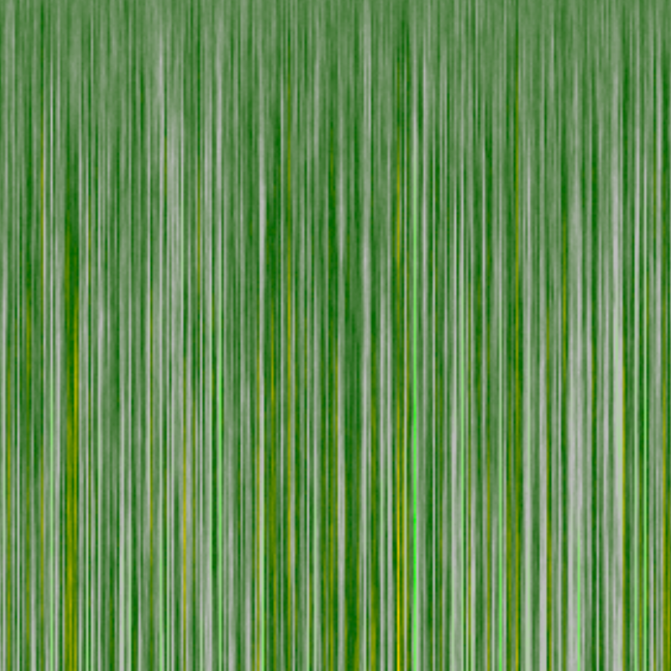
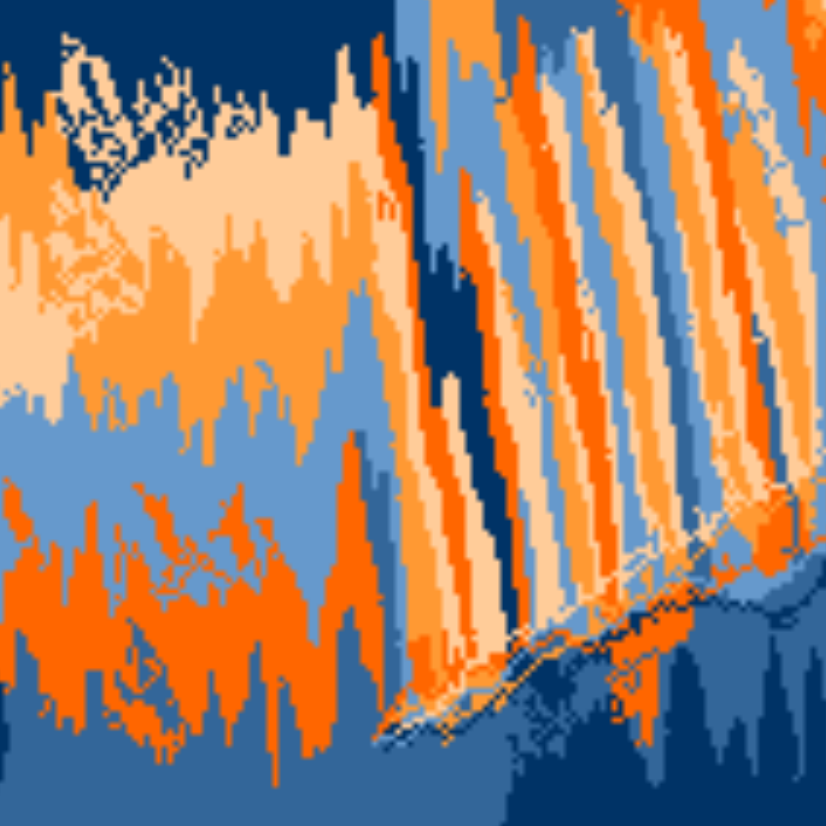
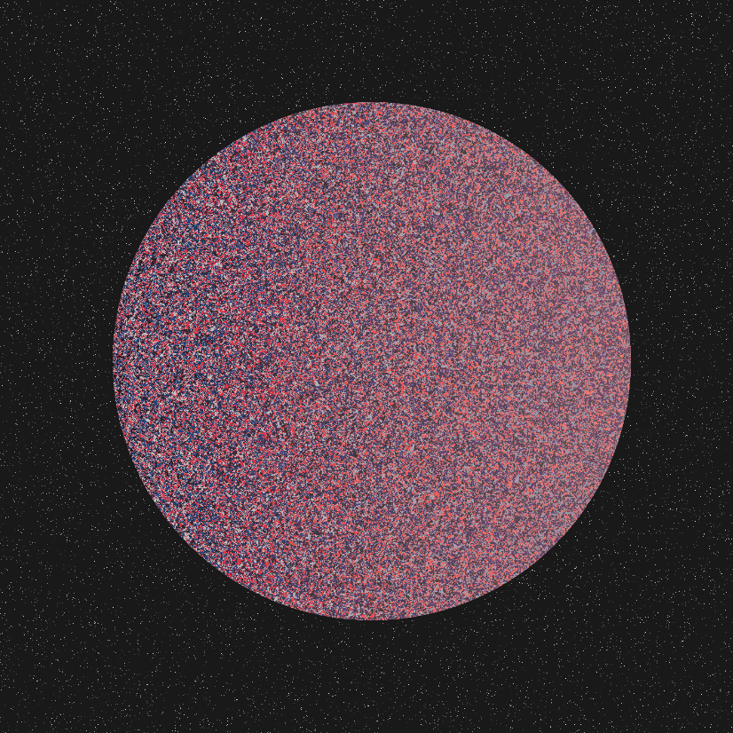

```{r setup, include=FALSE}
knitr::opts_chunk$set(echo = FALSE)
```


This is my FlexDashboard that I did with Alexandra and Andrea, they were both very fun to work with. 


<iframe src="https://abby-flynt.shinyapps.io/SamplingDistributions_Dashboard_Team1/" class="l-screen-inset shaded" height="1000px"></iframe>


Below is the generative art that I made before spring break, this was also a fun experience to do as well. 









This is an example from my ggextensions that I had done with Zach and Jean Marie, this was also a good group and I enjoyed working with those guys.

```{r, echo=FALSE}
library(ggplot2)
library(ggdensity)
data("iris")
iris = iris[complete.cases(iris), ]

attach(iris)
```

```{r, echo=FALSE}
ggplot(iris, aes(x = Sepal.Length, y = Petal.Length, fill=Species)) +
  geom_hdr()+
  geom_point(shape=21) +
  facet_wrap(vars(Species)) + 
  scale_fill_brewer(palette = "Dark2")
```
```{r, echo=FALSE}
load("plate.sizes.RData")
```

This is the graph I made for the first final that we did. WHile the first exam did not go amazing for me, this was an aspect I actually did feel pretty proud of, I think it looks pretty dang close to what I was on the exam itself. 

```{r, echo=FALSE}
load("plate.sizes.RData")
library(ggplot2)
ggplot(plates, aes(x=hunger,y=kcal.consumed,color=factor(plate.size), size=like.food))+
  geom_point(aes(alpha = .5))+
  scale_color_manual(values=c("darkorange2","royalblue4"),labels = c("small plate","large plate"))+
  scale_size_continuous(range=c(.5,10))+
  labs(title = "Calorie intake is tough to perdict",subtitle = "At least based on on hunger and likability of food",x="Reported Level of Hunger", y="Total Number of Calories consumed",size="Food Likability",color="Size of Plate")+
  theme_minimal()
```


```{r, echo=FALSE}
library(Lock5Data)
```
This was something I made for the Codebook. This came pretty early in the semester but I remember having a lot of fun with the alpha feature on it. It made for a very cool visualization. 

```{r, echo=FALSE}
ggplot(StudentSurvey, aes(x = Height, y = after_stat(density), color = Year, fill = Year)) +
geom_density(alpha = .7) +
scale_color_brewer(palette = "Dark4") +
scale_fill_brewer(palette = "Dark2")
```

