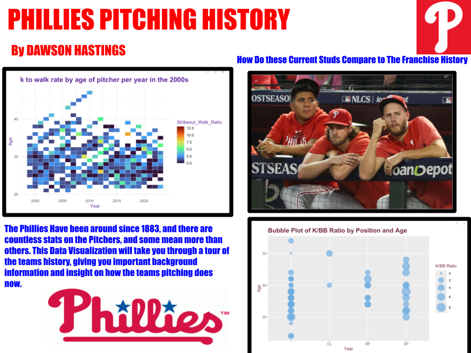

```{r setup, include=FALSE}
knitr::opts_chunk$set(echo = FALSE)

# Learn more about creating websites with Distill at:
# https://rstudio.github.io/distill/website.html

# Learn more about publishing to GitHub Pages at:
# https://rstudio.github.io/distill/publish_website.html#github-pages

```
   

This is my final Project, In the Past work RMD you will find prior works I have done, and in Pitching story you will learn about the pitching history of the Phillies.





